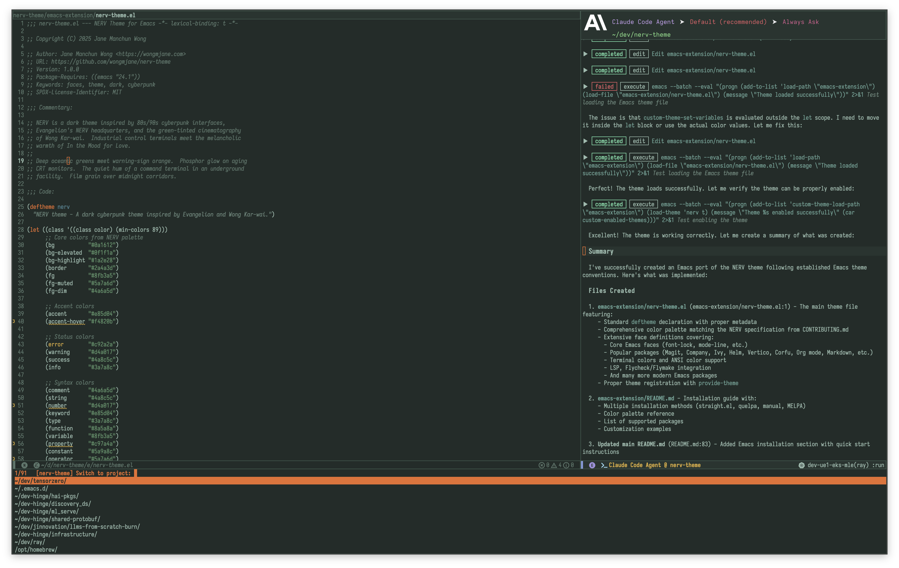

# NERV Theme for Emacs

A dark Emacs theme inspired by 80s/90s cyberpunk interfaces, Evangelion's NERV headquarters, and the green-tinted cinematography of Wong Kar-wai.



## Installation

### Using `straight.el`

```elisp
(use-package nerv-theme
  :straight (:host github :repo "wongmjane/nerv-theme"
             :files ("emacs-extension/nerv-theme.el"))
  :config
  (load-theme 'nerv t))
```

### Using `use-package` with `quelpa`

```elisp
(use-package nerv-theme
  :quelpa (nerv-theme :fetcher github
                      :repo "wongmjane/nerv-theme"
                      :files ("emacs-extension/nerv-theme.el"))
  :config
  (load-theme 'nerv t))
```

### Manual Installation

1. Download `nerv-theme.el` from this directory
2. Place it in your Emacs custom theme directory (e.g., `~/.emacs.d/themes/`)
3. Add the following to your init file:

```elisp
;; Add the themes directory to the load path
(add-to-list 'custom-theme-load-path "~/.emacs.d/themes/")

;; Load the theme
(load-theme 'nerv t)
```

### MELPA (Coming Soon)

Once available on MELPA:

```elisp
(use-package nerv-theme
  :ensure t
  :config
  (load-theme 'nerv t))
```

## Color Palette

The NERV theme uses these core colors:

| Role | Hex | Usage |
|------|-----|-------|
| Background | `#0a1612` | Deep sea darkness |
| Elevated Surface | `#0f1f1a` | Panels, modals |
| Foreground | `#8fb3a5` | Muted sage text |
| Accent | `#e85d04` | Signal orange |
| Functions | `#8a5a8a` | Subdued purple |
| Types | `#3a7a8c` | Industrial teal |
| Strings | `#4a8c5c` | Organic green |
| Keywords | `#e85d04` | Orange emphasis |
| Numbers | `#d4a017` | Gold |
| Comments | `#4a6a5d` | Dimmed text |

## Supported Packages

The theme includes custom faces for:

- **Completion frameworks**: Company, Ivy, Helm, Vertico, Corfu
- **Version control**: Magit, Git Gutter, Diff mode
- **Syntax checking**: Flycheck, Flymake
- **File management**: Dired, Treemacs
- **Markup languages**: Org mode, Markdown
- **Programming**: LSP, Web mode, Rainbow delimiters
- **Navigation**: Avy, Orderless, Marginalia
- **And more**: Eshell, Compilation, Hydra, Evil, Anzu

## Customization

While the theme works great out of the box, you can customize individual faces after loading the theme:

```elisp
(load-theme 'nerv t)

;; Example: Make comments brighter
(custom-set-faces
 '(font-lock-comment-face ((t (:foreground "#5a7a6d" :slant italic)))))
```

## Philosophy

This theme captures the feeling of solitude in a darkened room, information flowing across screens, the human operator at the center of vast systems. Deep oceanic greens meet warning-sign orange. Phosphor glow on aging CRT monitors.

## License

MIT License - See [LICENSE](../LICENSE) for details.

## Credits

Created by [Jane Manchun Wong](https://wongmjane.com), synthesized with [Claude Code](https://claude.ai/code).
